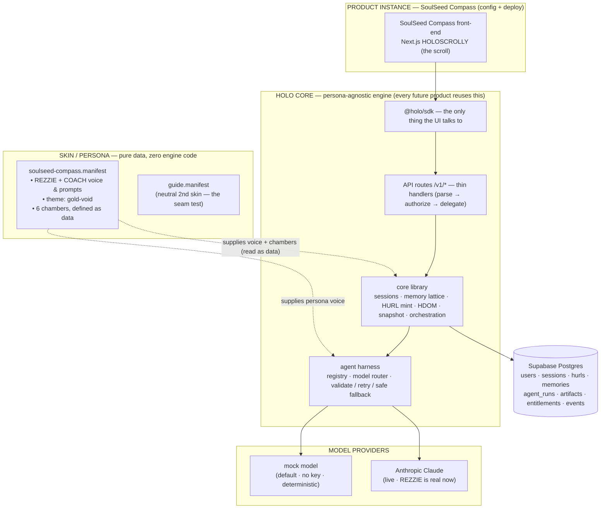
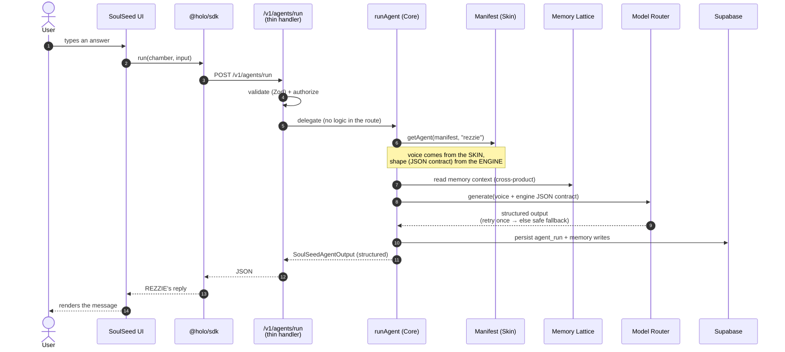

# SoulSeed Compass + HOLO Core — Flow Diagrams

*What we've actually built, in pictures. Last updated 2026-06-05 (v0.01, live).*

This answers Brooks's framing directly: **one engine, swappable skins.** The persona
(REZZIE / COACH) lives in a *data manifest* (the Skin), never inside the engine (the Core).
Three views below — the architecture, one live agent turn, and the user's journey.

> **Open `flow-diagram.html` in any browser** to see these rendered with no tooling.
> On GitHub, the Mermaid blocks below render automatically.

---

## 1 · The three layers (Core / Skin / Instance)

The whole point of the realignment: the engine knows nothing about REZZIE. A second product
is a new **Skin** (a manifest file) running on the *same* Core — zero engine code. That claim
is proven by an automated "seam test" in the codebase.

**Read it as:** the UI only ever speaks to the SDK → API → Core. The Core reads the **Skin
manifest** as data to learn the voice, the chambers, and which agent runs where. Swap the
manifest, get a different product — the boxes in "HOLO CORE" never change.

---

## 2 · One agent turn, end to end (this is live today)

What happens when a user answers in a chamber and REZZIE replies — including the safety nets
we just added (auto-retry + graceful fallback so a model blip never breaks the journey).

---

## 3 · The user journey — 6 chambers (the HOLOSCROLLY)

Anonymous-first: a permanent **HURL** is minted the moment someone arrives — no signup wall.
Email is captured only at the end, in exchange for the Snapshot.

```mermaid
flowchart LR
  Start(["Anonymous arrival<br/>→ mint HURL"]) --> C1
  C1["1 · Threshold<br/><i>What should I call you?</i>"] --> C2
  C2["2 · Identity Seed<br/><i>arrival vector</i>"] --> C3
  C3["3 · Present State<br/><i>What's alive now?</i>"] --> C4
  C4["4 · Memory Root<br/><i>What keeps coming back?</i>"] --> C5
  C5["5 · Trajectory Branch<br/>+ astro add-on slot (paywall)"] --> C6
  C6["6 · Living Invitation<br/>Snapshot + capture email"] --> Done(["SoulSeed Snapshot<br/>+ return seed"])

  classDef rezzie fill:#1c1407,stroke:#caa24a,color:#f4e6c3;
  classDef coach fill:#0c1620,stroke:#5fa8d3,color:#dcefff;
  class C1,C2,C3,C4,C5 rezzie;
  class C6 coach;
```

- **Chambers 1–5** are conducted by **REZZIE** (gold).
- **Chamber 6** is conducted by **COACH** (blue), who synthesizes everything into the Snapshot.
- The **astro add-on** in chamber 5 is a paid entitlement slot — the paywall is v1; the real
  astrology engine is v1.1 (parked, on purpose).

---

## Current status (what's real vs. pending)

| Piece | State |
|---|---|
| HOLO Core engine (sessions, memory, HURL, HDOM, snapshot, orchestration) | ✅ Built + deployed |
| 6-chamber SoulSeed journey, end to end | ✅ Live |
| REZZIE on a real Claude model (chambers 1–5) | ✅ Live |
| Anonymous-first auth + HURL minting + email-at-export | ✅ Live |
| Model resilience (auto-retry + safe fallback) | ✅ Live |
| Second-skin "seam test" (proves engine is persona-free) | ✅ Passing |
| COACH chamber-6 Snapshot on live model | 🔶 Deployed; live synthesis not yet smoke-tested |
| Stripe payment ($27 single tier) | 🔶 Behind a flag, not live |
| Astrology engine | 🅿️ Parked for v1.1 (paywall slot exists now) |
| Voice / Hume, agent grid, Compiled-Vector, 2nd product | 🅿️ Parked for v2 |

Live URL: **https://soulseed-compass.vercel.app**

---

### What Code does with this next

This doc is descriptive, not a spec — nothing to wire. If the diagrams drift from reality after
a change, update the three Mermaid blocks here and re-export `flow-diagram.html`
(`docs/flow-diagram.html` embeds the same source via the Mermaid CDN).
